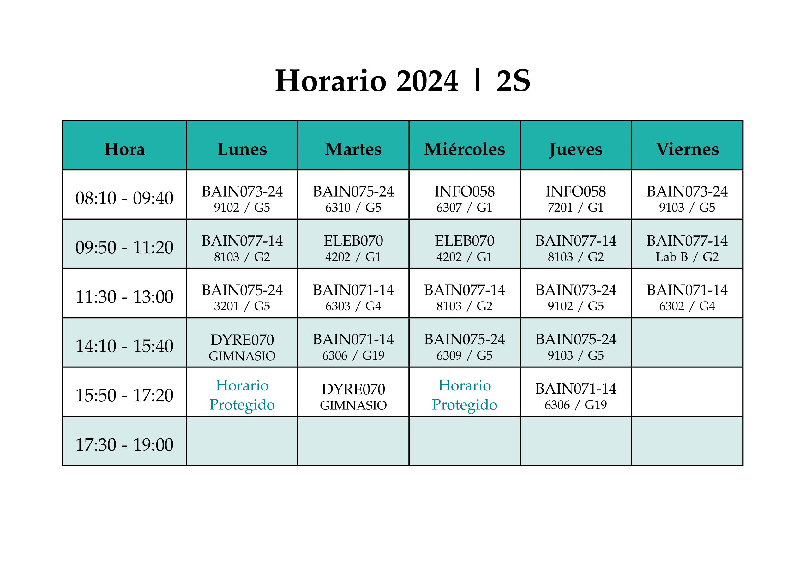
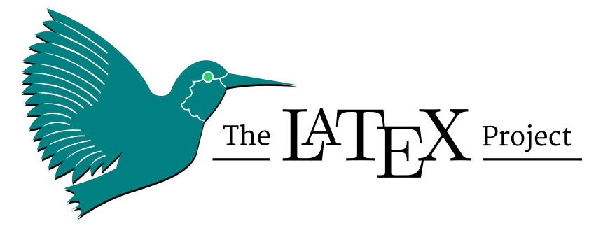
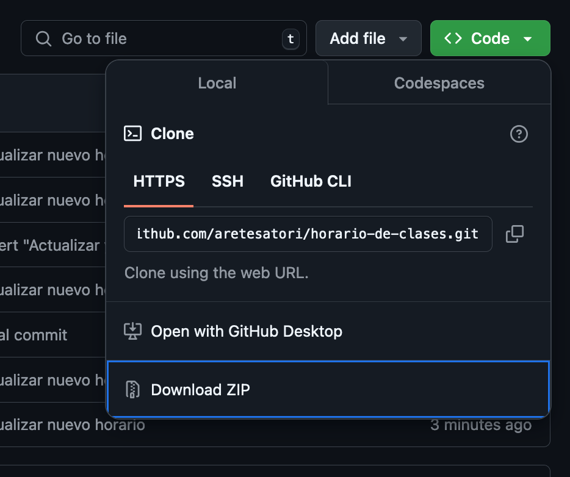
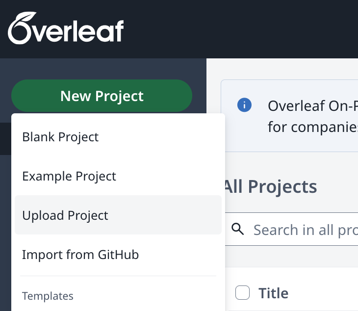
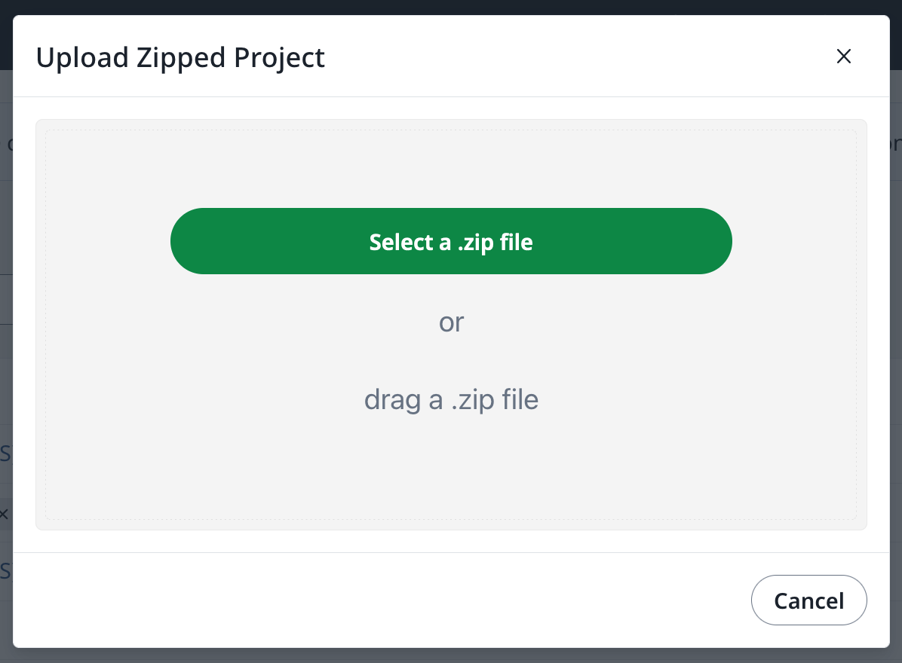
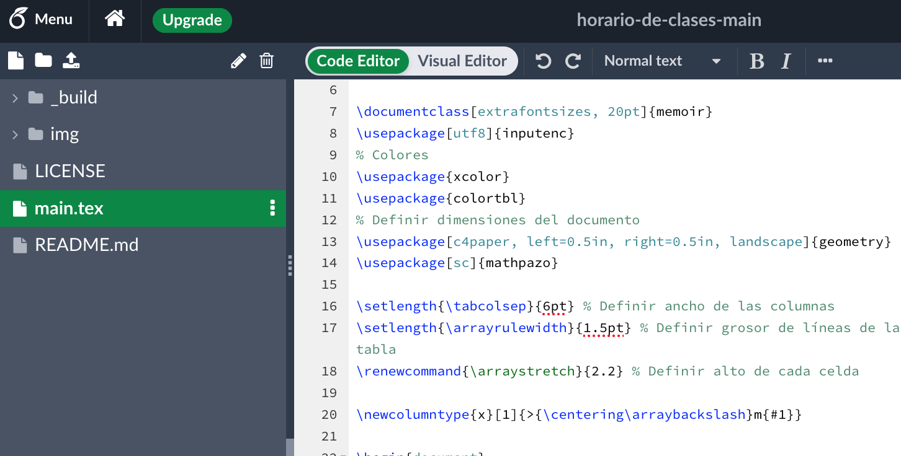

# 🗓️ Horario de Clases

En este repositorio se encuentra el desarrollo de una plantilla de horario de clases universitarias, diseñada y desarrollada en LaTeX.  
<br>
El código fuente se encuentra en `main.tex`.

---

# 🔎 Vista Previa



Se puede encontrar el documento PDF generado utilizando **pdfTeX** a partir del código fuente en `_build/main.pdf`.

---

# 📝 Como Editar el Documento (localmente)

<!--  -->

<p align="center">
    <a href="https://www.latex-project.org/get/">
    
    </a>
</p>

1. Asumiendo que se tiene `git` instalado, ejecute en la terminal:

```bash
git clone https://github.com/aretesatori/horario-de-clases.git
```

```bash
cd horario-de-clases/
```

2. Asumiendo que se tiene `MacTeX`, `TeX Live` o `MiKTeX` instalado localmente, en el directorio raíz de este repositorio descargado en el paso anterior, ejecute el siguiente comando en la terminal (MacOS/Linux):

```bash
pdflatex -output-directory=_build main.tex
```

3. De forma predeterminada, el archivo generado debería ser `main.pdf`, dentro del directorio `_build`.

---

# 📝 Como Editar el Documento (online)

<!--  -->

<p align="center">
    <a href="https://www.overleaf.com/">
    
    </a>
</p>

1. Descargue este repositorio (https://github.com/aretesatori/horario-de-clases) como un archivo comprimido ("Download ZIP").

<p align="center">
    
</p>

2. Ingrese a [Overleaf](https://www.overleaf.com/). Cree una cuenta o realice login con su cuenta existente.

3. En Overleaf, suba el archivo descargado en el paso 1.

En la página principal de proyectos, una vez accedida con su cuenta, haga clic en el botón ubicado en la esquina superior izquierda:

> **New Project** > **Upload Project**

<p align="center">
    
</p>

Luego, suba el archivo comprimido (`horario-de-clases-main.zip`).

<p align="center">
    
</p>

4. Una vez cargado el archivo, Overleaf debería identificar el archivo principal `main.tex` y mostrar la estructura del repositorio al lado izquierdo.

<p align="center">
    
</p>

5. Siéntase libre de editar y personalizar la plantilla a su gusto.

---

# 🌐 Referencias

> Get LaTeX - Mac OS, Windows, Linux (https://www.latex-project.org/get/)

> Overleaf, Online LaTeX Editor (https://www.overleaf.com/)